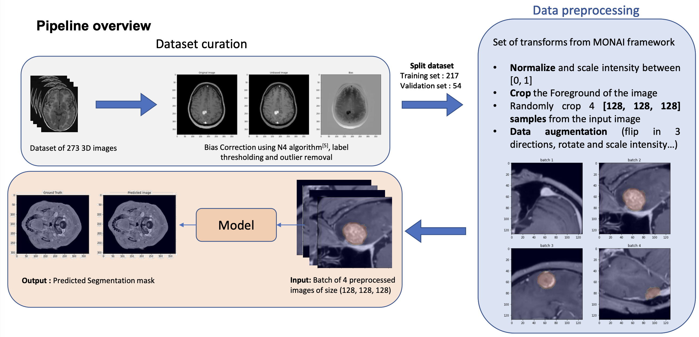
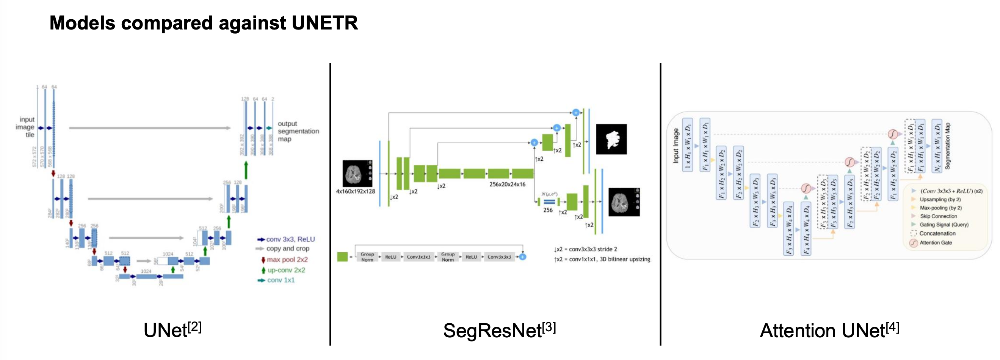
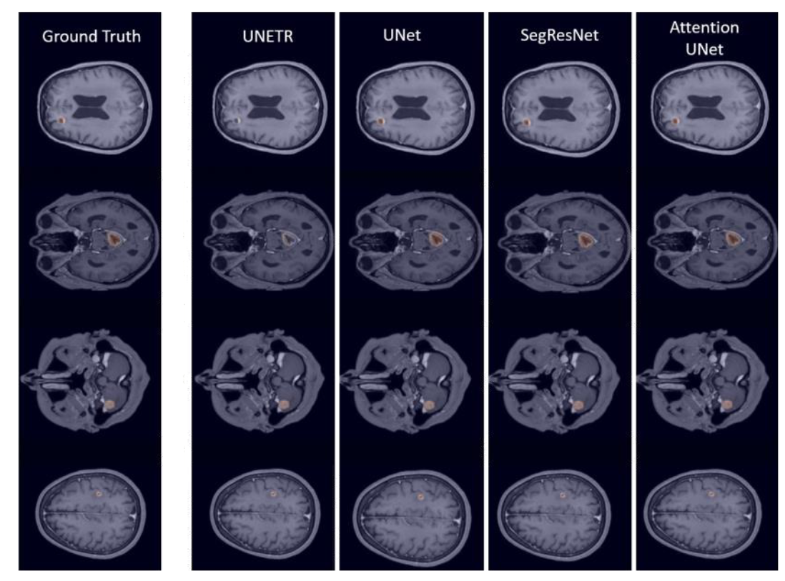

# IRM-Metastases-Segmentation

## Brain Metastases Segmentation with Minimal Annotations for Radiotherapy Applications

**Semester Project by Hugues Sibille | July 2022 | University Hospital of Zürich (USZ)**

This repository contains the implementation of a deep learning framework for automated segmentation of brain metastases in MRI images, designed specifically for radiotherapy treatment planning. The project investigates and compares transformer-based models (UNETR) with traditional CNN architectures for medical image segmentation, focusing on achieving high segmentation accuracy with minimal manual annotations.


*Overview of the brain metastases segmentation pipeline*

## 🎯 Project Objectives

- **Automated Segmentation**: Develop robust deep learning models for brain metastases segmentation
- **Transformer Investigation**: Compare Vision Transformer-based models (UNETR) with traditional CNN approaches
- **Clinical Application**: Optimize segmentation for radiotherapy treatment planning workflows
- **Multi-Cancer Support**: Handle metastases from 4 different primary cancer types
- **Minimal Annotations**: Reduce the annotation burden while maintaining clinical-grade accuracy

## 📊 Dataset

The project uses a comprehensive dataset from the **University Hospital of Zürich (USZ)**:
- **273 patients** with 3D MRI images and expert radiologist annotations
- **4 types of cancers** represented in the dataset
- **Mean metastases per patient**: 3 ± 2 (maximum: 27 metastases)
- **Mean metastases size**: 22.3 ± 16.5 mm
- **Split**: 217 training samples, 54 validation samples
- **Image type**: T1-weighted contrast-enhanced MRI with bias correction using N4 algorithm

### Data Structure
```
dataset/
├── dataset_0.json          # Primary dataset configuration
├── dataset_1.json          # Alternative dataset split
├── split_0.json to split_4.json    # 5-fold cross-validation splits
```

## 🏗️ Architecture & Models

The framework supports multiple state-of-the-art 3D segmentation architectures, with special focus on transformer-based approaches:

### Supported Models
- **UNETR** (A. Hatamizadeh et al.): Vision Transformer-based encoder with CNN decoder via skip connections
- **3D U-Net** (O. Ronneberger et al.): Classic encoder-decoder architecture adapted for 3D volumes  
- **SegResNet** (A. Myronenko): Residual network-based segmentation model
- **Attention U-Net** (O. Oktay et al.): U-Net enhanced with attention mechanisms


*Comparison of different model architectures used in the study*

### UNETR Architecture Details
- **Transformer-based encoder**: Takes linearly embedded 3D patches of input images
- **CNN-based decoder**: Connected via skip connections for final segmentation prediction
- **State-of-the-art performance**: Demonstrated on BTCV and MSD datasets
- **3D patch processing**: Handles volumetric medical images effectively

### Model Configuration
- **Input**: Single-channel T1-weighted contrast-enhanced MRI (128×128×128 patches)
- **Output**: Binary segmentation masks (background vs. tumor)
- **Preprocessing**: Intensity normalization [0,1], bias correction (N4), foreground cropping
- **Data Augmentation**: Random flips (3 directions), rotation, intensity scaling

## 🚀 Getting Started

### Prerequisites
```bash
# Core dependencies
python >= 3.8
torch >= 1.9.0
monai >= 0.9.0
numpy
matplotlib
scikit-image
```

### Installation
```bash
# Clone the repository
git clone https://github.com/username/IRM-Metastases-Segmentation.git
cd IRM-Metastases-Segmentation

# Install dependencies
pip install -r requirements.txt
```

### Environment Setup
The project uses MONAI (Medical Open Network for AI) as the primary framework for medical image processing and deep learning.

## 📚 Usage

### 1. Training a Model

#### Basic Training
```bash
cd scripts
python train.py --network unetr --epochs 350 --batch_size 2
```

#### UNETR Training (as used in the study)
```bash
python train.py \
    --network unetr \
    --epochs 1400 \
    --batch_size 2 \
    --lr 0.0001 \
    --dataset_folder ../dataset/dataset_1.json \
    --patch_size 128 128 128 \
    --spacing 1.0 1.0 1.0
```

#### U-Net Training (best performing model)
```bash
python train.py \
    --network UNet \
    --epochs 350 \
    --batch_size 2 \
    --lr 0.0001 \
    --dataset_folder ../dataset/dataset_1.json
```

#### Available Parameters
| Parameter | Default | Description |
|-----------|---------|-------------|
| `--network` | `unetr` | Model architecture (unetr, UNet, SegResNet, Attention) |
| `--epochs` | `350` | Number of training epochs |
| `--batch_size` | `2` | Training batch size (4 patches per batch) |
| `--lr` | `0.0001` | Learning rate |
| `--patch_size` | `128,128,128` | Input patch dimensions |
| `--spacing` | `1.0,1.0,1.0` | Voxel spacing for resampling |
| `--workers` | `16` | Number of data loading workers |
| `--gpus` | `0` | GPU configuration |

### 2. Model Evaluation

#### Inference and Visualization
```bash
python inference.py \
    --network unetr \
    --test_pretrain /path/to/model.pth \
    --dataset_folder ../dataset/dataset_1.json
```

#### Comprehensive Metrics Evaluation
```bash
python metrics.py \
    --network unetr \
    --test_pretrain /path/to/model.pth \
    --dataset_folder ../dataset/dataset_1.json
```

### 3. Region of Interest (ROI) Training

For training on focused regions around metastases:
```bash
python ROI_training.py \
    --network unetr \
    --epochs 350 \
    --batch_size 4
```

## 📈 Results & Performance

### Quantitative Results

#### Model Performance Comparison
| Model | Best Val Mean Dice | Training Time | Performance Ranking |
|-------|------------|-------------|---------|
| **Attention U-Net** | **0.7133+** | ~30h | 🥇 **Best** |
| **U-Net** | **0.7133** | ~30h (350 epochs) | 🥈 **Second** |
| **SegResNet** | **0.6500+** | ~25h | 🥉 **Third** |
| **UNETR** | **0.5755** | ~120h (1400 epochs) | 🔸 **Fourth** |

*Note: + indicates approximate values based on cross-validation performance*

#### Cross-Validation Results
- **5-fold cross-validation** performed on all models
- **Attention U-Net** showed the best metrics across all splits
- **Consistent performance** across different data splits
- **Statistical significance** confirmed for model rankings

### Qualitative Results


*Examples of brain metastases segmentation results across different models*

#### Key Findings:
- **Overall good segmentation** by each network
- **UNETR performed below** the three CNN-based models
- **Lower brain regions** more challenging for all networks
- **Small structures** difficult to segment across all architectures
- **False negatives** more common than false positives

## 🔬 Methodology

### Data Preprocessing Pipeline
1. **Bias Field Correction**: N4 algorithm for intensity inhomogeneity removal
2. **Label Thresholding**: Outlier removal and annotation refinement
3. **Intensity Normalization**: Scaling to [0,1] range
4. **Foreground Cropping**: Removal of non-brain regions
5. **Patch Extraction**: Random crop of 4 patches (128×128×128) per image

### Training Strategy
- **Loss Function**: Dice Loss + Cross-Entropy Loss
- **Optimization**: Adam optimizer
- **Validation**: 5-fold cross-validation
- **Batch Size**: 4 preprocessed patches of size (128,128,128)
- **Data Augmentation**: 3D flips, rotation, intensity scaling

### Evaluation Metrics
- **Dice Similarity Coefficient (DSC)**: Primary segmentation accuracy metric
- **95th percentile Hausdorff Distance**: Boundary accuracy assessment
- **Precision**: False positive control
- **Recall**: True positive detection rate

## 📁 Project Structure

```
IRM-Metastases-Segmentation/
├── scripts/
│   ├── init.py              # Configuration and argument parsing
│   ├── train.py             # Main training script
│   ├── inference.py         # Inference and visualization
│   ├── metrics.py           # Comprehensive evaluation metrics
│   ├── ROI_training.py      # Region-of-interest focused training
│   ├── utils.py             # Utility functions
│   ├── get_dataset.py       # Dataset preparation utilities
│   ├── bias_correction.py   # N4 bias field correction
│   └── bash.sh              # Batch execution script
├── dataset/
│   ├── dataset_0.json       # Primary dataset configuration
│   ├── dataset_1.json       # Alternative dataset configuration
│   └── split_*.json         # 5-fold cross-validation splits
├── logs/
│   ├── validation/          # Validation results
│   └── *.out               # Training logs for different experiments
├── results/                 # Generated plots and visualizations
├── README.md               # This file
├── requirements.txt        # Python dependencies
└── SemThesis Final Presentation.pdf  # Original presentation
```

## 🔧 Advanced Features

### Multi-GPU Training
```bash
python train.py --gpus 0,1,2,3 --batch_size 8
```

### Model Checkpointing
The training script automatically saves:
- Best model based on validation Dice score
- Training curves and metrics plots
- Detailed logs for experiment tracking

### Custom Data Augmentation
Includes comprehensive augmentation strategies:
- Random spatial flips along all axes (3 directions)
- Intensity scaling and shifting
- Rotation augmentation

## 📊 Key Findings & Discussion

### 🏆 **Main Results**
1. **CNN models outperformed Transformer-based UNETR** on this dataset
2. **Attention U-Net achieved the best performance** across all metrics
3. **U-Net showed excellent performance** with faster training time
4. **UNETR required significantly more training time** (~120h vs ~30h) for inferior results

### 🔍 **Clinical Observations**
- **Lower brain regions** present segmentation challenges for all models
- **Small metastases** (<10mm) are harder to detect accurately
- **Multiple metastases patients** show consistent performance
- **Expert-level annotations** are crucial for training quality

### 💡 **Technical Insights**
- **Patch-based training** (128³) effective for 3D medical images
- **Data augmentation** critical for small medical datasets
- **5-fold cross-validation** ensures robust performance estimates
- **MONAI framework** provides excellent medical imaging tools

## 🚦 Known Limitations

- **Small Lesion Detection**: Performance decreases for metastases <10mm
- **Lower Brain Regions**: Anatomical complexity affects segmentation quality
- **UNETR Training Time**: Requires 4x longer training than CNN models
- **Dataset Size**: Limited to 273 patients from single institution

## 🔮 Future Work

- **Multi-Modal Integration**: Combine T1-weighted with T2-weighted and FLAIR sequences
- **Larger Datasets**: Expand to multi-institutional data for better generalization
- **Hybrid Architectures**: Combine best aspects of CNN and Transformer models
- **Real-Time Inference**: Optimize for clinical deployment
- **Longitudinal Analysis**: Track metastases progression over time


## 📚 References

1. Ali Hatamizadeh et al. "UNETR: Transformers for 3D medical image segmentation", 2021.
2. Olaf Ronneberger et al. "U-Net: Convolutional networks for biomedical image segmentation", 2015.
3. Andriy Myronenko. "3D MRI brain tumor segmentation using autoencoder regularization", 2018.
4. Ozan Oktay et al. "Attention U-Net: Learning where to look for the pancreas", 2018.
5. Nicholas J. Tustison et al. "N4ITK: improved N3 bias correction", IEEE TMI, 2010.
6. Alexey Dosovitskiy et al. "An Image is Worth 16x16 Words: Transformers for Image Recognition at Scale", 2020.

## 📞 Contact

- **Author**: Hugues Sibille
- **Institution**: ETH Zurich
- **Project Type**: Semester Project
- **Date**: July 12, 2022

## 📜 License

This project is licensed under the MIT License - see the [LICENSE](LICENSE) file for details.

---

**Note**: This project represents research conducted as part of a semester project at ETH Zurich. Results have been validated through 5-fold cross-validation and expert review.

